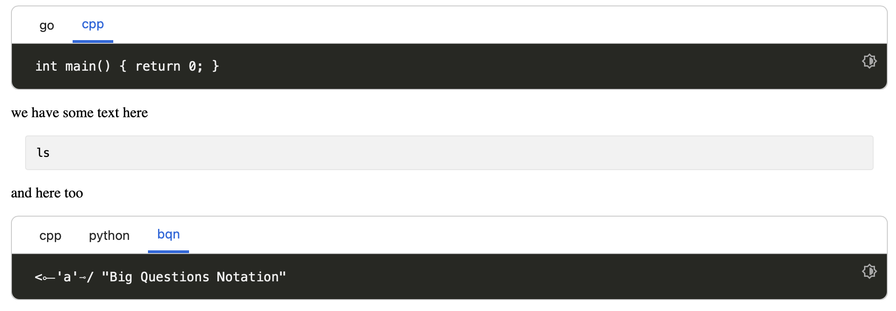

# codetabs.el

This package takes consecutive src blocks in org mode files and turn them into multi language code snippets in HTML.

For example:

``` org
#+begin_src go
  //...
#+end_src

#+begin_src cpp
  //...
#+end_src
```

will create a code snippets with horizontal tabs (go and cpp) and let you select the language you want to see the code in.

## Philosophy

Do not rewrite your org files, simply customize JS/CSS

## Example

You can try it by yourself in the `example` directory.

```
cd example
emacs -Q main.org
```

Then, `eval-buffer` the `init.el` file, go back to `main.org` and `C-C C-e h h`.

In `main.html`, you should have something like:


